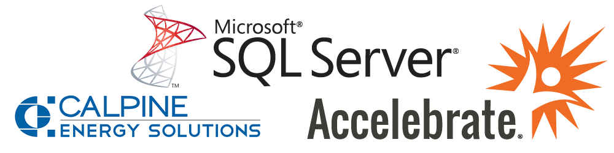

> # **Course Name:  SQL Server Query Performance Tuning**
> ## **Course Number:  Accelebrate SQL-626**
> ## **Duration:  3 Days**
> ## **Instructor:  Jeff McBride**
> ## **Instructor E-Mail:  jeff@geeklearn.com**
> ## **Prerequisites:  SQL Server Query Development Experience**

## **Training Overview**
Accelebrate's SQL Server Query Performance Tuning training course teaches attendees everything they need to know to tune their SQL queries and improve execution speed.  Students learn how to fix relational design issues in their databases, create execution plans, collect performance data, add indexes to boost performance, and utilize statistics to deal with skewed data distribution.

**Note:** This SQL Server course is appropriate for versions to 2012-2019.

## **Training Outline**

<!-- Day 1 -->
### **Introduction**

### **Query Performance Tuning Process**
* Query and System Oriented Tuning
* SQL Server Architecture
* Database Components that Effect Performance
* Query Execution Process
* Query Performance Killers

### **Relational Design and Database Objects**
* Normal and Denormalized Database Design
* Dealing with LOB Data
* Index Types and Best Practices
* Views and Indexed Views
* Data Distribution and Statistics

### **Execution Plans and Operators**
* Parsing, Binding, and Query Optimization Process
* Query Optimizer Improvements [SQL Server 2014 and Later]
* Logical and Physical Execution Plan Operators
* Viewing Execution Plans
* Understanding Execution Plan Properties
* Performance Timed and IO Statistics
* Buffer Cache and Logical vs Physical Page Reads
* Data Access Operators
* Join Operators
* Other Operators
* Parallelism
* Query Writing Best Practices
* Reducing Query Resource Usage

<!-- Day 2 -->
### **Collecting Query Performance Data**
* Locating Queries with Performance Issues
* SQL Server Activity Monitor
* SQL Server Management Studio Reports
* Query Store [SQL Server 2016 and Later]
* Dynamic Management Objects (DMOs)
* Collecting SQL Server Events
* Extended Events
* Extended Events GUI [SQL Server 2012 and Later]
* SQL Profiler (Deprecated)
* Creating Application Baselines

### **Using Indexes to Improve Performance**
* Best scenarios for Clustered and NonClustered Indexes
* Index Design Recommendations
* Lookups vs Covering Indexes
* Filtered Indexes
* Index Intersections and Index Joins
* Indexed Views
* Fragmentation Issues
* FillFactor and Padindex
* Rebuilding and Reorganizing Indexes
* Database Engine Tuning Advisor

<!-- Day 3 -->
### **Statistics and Cost-Based Optimization**
* Cost Based Optimizer
* Selectivity, Density, and Cardinality of Data
* New Cardinality Estimator Algorithms [SQL Server 2014 and Later]
* Data Distribution Issues with CBO
* Statistics to Track Data Distribution
* Automatic Statistics
* Manually Creating and Updating Statistics

### **Execution Plan Caching and Recompilation**
* Plan Cache
* Ad Hoc Query Optimizations
* Prepared Workloads
* Stored Procedures
* Plan Recompilation
* Parameter Sniffing Issues
* Recompile Hints and Options
* Plan Guides

### **Transact-SQL Considerations**
* Temp Tables and Table Variables
* Using Temp Tables Efficiently
* Performance Pitfalls in T-SQL Code
* Declarative Referential Integrity vs T-SQL Code
* Triggers Performance Considerations
* Transactions and Locking
* Tuning and Alternatives to Cursors
* Sequence Objects [SQL Server 2012 and Later]
* Pagination with OFFSET and FETCH [SQL Server 2012 and Later]
* JSON Support [SQL Server 2016 and Later]

### **Real World Query Tuning**

### **Conclusion**